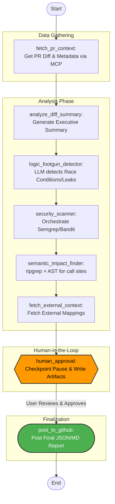

# Stateful PR Review Agent

A language-agnostic, general-purpose PR Review Agent built with **LangGraph** and **PydanticAI**. It dynamically fetches PR diffs, orchestrates polyglot analysis tools (like Semgrep and ripgrep), and pauses for Human-in-the-Loop approval before posting a final structured report.

---

## 🏗️ Technical Architecture

The core of the agent is a **LangGraph State Machine**. It manages the state (`AgentState`) as a `TypedDict`, which accumulates findings as the diff moves through various specialized nodes. 

### Key Technologies
- **LangGraph**: Handles the sequential flow of nodes, state accumulation, and checkpointing (`MemorySaver`) to allow execution to pause and wait for human input.
- **PydanticAI**: Ensures all LLM outputs and generated artifacts adhere to strictly defined schemas (e.g., `DiffSummary`, `FootgunFinding`, `SemanticImpactFinding`).
- **Hybrid Source Analysis**:
  - **Tooling**: Uses `Semgrep` (polyglot) and `Bandit` (Python) for security scans.
  - **Text-search**: Uses `ripgrep` for blazing-fast indexing of the workspace.
  - **LLMs**: Used for high-level semantic AST parsing, verifying if signature changes break existing call sites across languages (Java, TS, Go, etc.).

---

## 🔄 Execution Flow Chart

The following Mermaid diagram outlines the active nodes in the LangGraph and how they relate to the Human-in-the-Loop mechanism:



---

## 🚀 How to Run

Follow these instructions to run the agent locally or run the integrated tests.

### 1. Prerequisites
Ensure you have Python 3.10+ installed and your virtual environment activated.
```bash
# From the project root (e:\rnd\antigravity\prreviewsystem)
.\.venv\Scripts\Activate.ps1
```

### 2. Running the Agent (MVP Mock)
You can invoke the agent directly from the command line. This will start the LangGraph and run through all analysis nodes before hitting the `human_approval` pause.

```bash
# Make sure the src directory is in the PYTHONPATH
$env:PYTHONPATH="src"

# Run the graph and pass an initial PR url
python -c "from src.agent import graph; print(graph.invoke({'pr_url': 'https://github.com/mock/repo/pull/123'}, {'configurable': {'thread_id': 'run_1'}}))"
```
**What happens:** 
The script will output the logs of each node executing. It will generate `reports/PR_Review.json`, print a summary to the console, and then completely **pause** execution.

### 3. Resuming the Agent (Approving)
Once you have reviewed the artifacts in the `reports/` folder, you can resume that exact same thread (`run_1`) by injecting an updated state (`human_approved: True`) and invoking the graph again with `None`.

```bash
python -c "from src.agent import graph; config={'configurable': {'thread_id': 'run_1'}}; graph.update_state(config, {'human_approved': True}); print(graph.invoke(None, config))"
```
**What happens:**
The agent recognizes the approval, moves to the `post_to_github` node, and completes execution.

### 4. Running the Test Suite
A pytest file (`tests/test_agent.py`) is provided that simulates exactly what is described above programmatically to ensure the graph respects checkpoints.

```bash
$env:PYTHONPATH="src"
python -m pytest tests/ -v
# OR run the script directly:
python tests/test_agent.py
```
